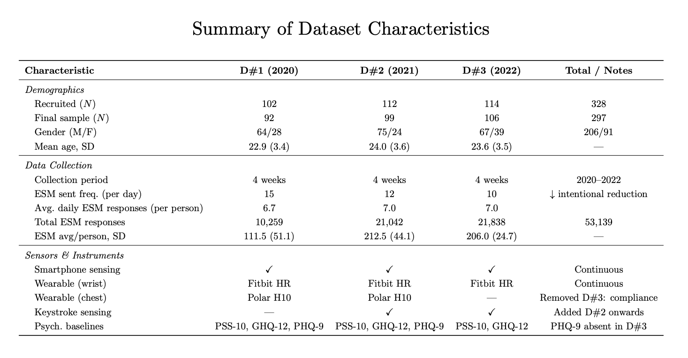

# [DATASET_NAME] (D1–D3)

> A three-wave in-the-wild smartphone and wearable sensing dataset for moment-level affect modeling in everyday life.

[](https://creativecommons.org/licenses/by-nc/4.0/)
[](https://doi.org/TODO)
[](https://TODO)
[](./DATASHEET.md)
[](https://dataverse.harvard.edu/TODO)

---

## Overview

This repository contains documentation, code, and metadata for **D1, D2, and D3** — three consecutive annual waves of an in-the-wild affective sensing study. Each wave collected passive sensor data from participants' own Android smartphones and Fitbit wearables, paired with dense in-situ affective state labels via Experience Sampling Method (ESM).

Together, the three waves provide **53,139 ESM responses** from **297 participants** (328 before quality control), collected across 2020–2022 in naturalistic everyday settings.

**The dataset is designed to support:**
- Moment-level affect prediction (valence, arousal, stress, disturbance)
- Within-person (personalized) vs. cross-person generalization benchmarks
- Cross-dataset (cross-wave) transfer learning experiments
- Longitudinal and individual-difference analyses in mobile affective computing

---

## Dataset at a Glance

<!-- | Property | D1 | D2 | D3 |
|---|---|---|---|
| **Collection period** | Feb–Apr 2020 (~30 days) | Dec 2020–Jan 2021 (~30 days) | Nov 2021–Jan 2022 (~28 days) |
| **Participants (after QC)** | 92 | 99 | 106 |
| **ESM responses (after QC)** | 10,259 | 21,042 | 21,838 |
| **Mean responses/person** | 111.5 (SD=51.1) | 212.5 (SD=44.1) | 206.0 (SD=24.7) |
| **Smartphone** | Android ≥7.0 | Android ≥8.0 | Android ≥8.0 |
| **Wearable** | Fitbit + Polar H10 | Fitbit + Polar H10 | Fitbit only |
| **Shared labels** | Valence, Arousal, Stress, Disturbance | ← | ← |
| **Additional labels** | Attention, MentalLoad, Duration, Change | Attention, MentalLoad, Duration, ChangedValence, ChangedArousal | PANAS-style affect words (8 items) | -->



**Shared core labels** (7-point scale, −3 to +3): Valence, Arousal, Stress, Task Disturbance  
**D1/D2 additional labels** (−3 to +3): Attention, MentalLoad; D1 also has Change; D2 also has ChangedValence, ChangedArousal  
**D3 affect-word labels** (0 to +6): Happy, Relaxed, Cheerful, Content, Sad, Anxious, Depressed, Angry  
See [`data/schema.md`](./data/schema.md) for the full label reference.

---

## Benchmark Ladder

| Tier | Setting | Description |
|---|---|---|
| **Tier A** | Personal-history predictability | Predict affect from each user's own history |
| **Tier B** | Within-dataset cross-user transfer | Train on some users, test on held-out users in the same wave |
| **Tier C** | Cross-dataset transfer | Train on one wave (e.g., D1), test on another (e.g., D3) |

See [`/benchmark`](./benchmark/) for replication code and results.

---

## Preprocessing Pipeline

All three waves were processed using the reproducible mobile sensing pipeline introduced in:

> Zhang, P., Jung, G., Alikhanov, J., Ahmed, U., & Lee, U. (2024). **A Reproducible Stress Prediction Pipeline with Mobile Sensor Data.** *Proceedings of the ACM on Interactive, Mobile, Wearable and Ubiquitous Technologies*, 8(3). https://doi.org/10.1145/3678578

Refer to that paper and [`/preprocessing`](./preprocessing/) for full implementation details.

---

## Repository Structure

```
CrossUserDataset/
│
├── README.md                        ← You are here
├── DATASHEET.md                     ← Gebru et al. datasheet (NeurIPS requirement)
├── LICENSE                          ← Code license (MIT)
├── CITATION.cff                     ← Machine-readable citation
│
├── data/
│   ├── README.md                    ← Dataverse link, download instructions,
│   │                                   folder structure, how to load files
│   └── schema.md                    ← Column-by-column reference for all file types
│
├── preprocessing/
│   ├── README.md                    ← Points to Zhang et al. (2024) pipeline paper
│   └── pipeline_decisions.md        ← Per-wave QC thresholds and known deviations
│
├── benchmark/
│   ├── README.md                    ← Explains the three-tier benchmark ladder
│   ├── utils/                       ← Shared: data loader, label encoding, metrics
│   ├── tier_a/                      ← Tier A: personal-history predictability
│   ├── tier_b/                      ← Tier B: within-dataset cross-user transfer
│   └── tier_c/                      ← Tier C: cross-dataset transfer across waves
│
├── eda/
│   └── README.md                    ← EDA notebooks characterizing temporal density,
│                                       label distributions, missingness, and
│                                       individual variability across all three waves
│
└── metadata/
    └── croissant.json               ← ML Commons Croissant metadata (NeurIPS requirement)
```

---

## Data Access

The dataset is hosted on **Harvard Dataverse** with gated access. Users must log in and agree to the Data Use Agreement on the Dataverse page before downloading. Access is open to all academic researchers — no manual approval is required, agreement to terms is immediate.

**To download:**
1. Visit the dataset page at **[TODO: Harvard Dataverse URL]**
2. Log in or create a free Harvard Dataverse account
3. Read and agree to the Data Use Agreement
4. Download individual wave archives (D1, D2, D3) or the full dataset

**Download via Dataverse API (requires agreeing to terms on the website first):**
```bash
# Download a specific wave archive using your API token
curl -L "https://dataverse.harvard.edu/api/access/datafile/TODO_FILE_ID" \
     -H "X-Dataverse-key: YOUR_API_TOKEN" \
     -o D1.zip
```

**Download via Python:**
```python
import requests

api_token = "YOUR_API_TOKEN"  # from Dataverse account → API Token
file_id   = "TODO"            # file ID from the Dataverse dataset page

r = requests.get(
    f"https://dataverse.harvard.edu/api/access/datafile/{file_id}",
    headers={"X-Dataverse-key": api_token}
)
with open("D1.zip", "wb") as f:
    f.write(r.content)
```

See [`data/README.md`](./data/README.md) for full folder structure and loading instructions.

**Data directory structure (after download and extraction):**
```
data/
├── D1/
│   ├── UserInfo.csv        ← participant demographics + questionnaires
│   ├── EsmResponse.csv     ← raw ESM self-report labels
│   ├── Valence.pkl         ← pre-extracted feature matrix for Valence
│   ├── Arousal.pkl
│   ├── Stress.pkl
│   ├── Disturbance.pkl
│   ├── Attention.pkl       ← D1 and D2 only
│   ├── MentalLoad.pkl      ← D1 and D2 only
│   ├── Duration.pkl        ← D1 and D2 only
│   └── Change.pkl          ← D1 only
├── D2/
│   ├── UserInfo.csv
│   ├── EsmResponse.csv
│   ├── Valence.pkl / Arousal.pkl / Stress.pkl / Disturbance.pkl
│   ├── Attention.pkl / MentalLoad.pkl / Duration.pkl
│   ├── ChangedValence.pkl  ← D2 only
│   └── ChangedArousal.pkl  ← D2 only
└── D3/
    ├── UserInfo.csv
    ├── EsmResponse.csv
    ├── Valence.pkl / Arousal.pkl / Stress.pkl / Disturbance.pkl
    ├── Happy.pkl / Relaxed.pkl / Cheerful.pkl / Content.pkl
    ├── Sad.pkl / Anxious.pkl / Depressed.pkl / Angry.pkl
```

---

## Citation

```bibtex
@dataset{TODO,
  title     = {TODO: Dataset Title},
  author    = {TODO},
  year      = {2025},
  doi       = {TODO},
  url       = {TODO},
  note      = {NeurIPS 2025 Datasets and Benchmarks Track}
}

@article{zhang2024reproducible,
  title     = {A Reproducible Stress Prediction Pipeline with Mobile Sensor Data},
  author    = {Zhang, Panyu and Jung, Gyuwon and Alikhanov, Jumabek and Ahmed, Uzair and Lee, Uichin},
  journal   = {Proceedings of the ACM on Interactive, Mobile, Wearable and Ubiquitous Technologies},
  volume    = {8},
  number    = {3},
  year      = {2024},
  doi       = {10.1145/3678578}
}
```

---

## License and Ethics

All data collection procedures were approved by the **[TODO: IRB name and approval number]**. Participants provided written informed consent and were compensated ~100 USD. Personally identifiable information was anonymized prior to release (MD5-hashed contact numbers, UUID-replaced MAC addresses, GPS longitude displacement).

The dataset is released under **CC BY-NC 4.0** (non-commercial academic research only). Full terms are available on the [Harvard Dataverse dataset page](https://dataverse.harvard.edu/TODO). Code in this repository is released under the **MIT License**.

---

## Contact

For questions about the dataset or code, contact **[TODO: author email]** or open a GitHub issue.
